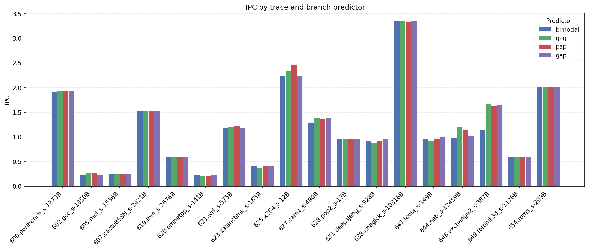
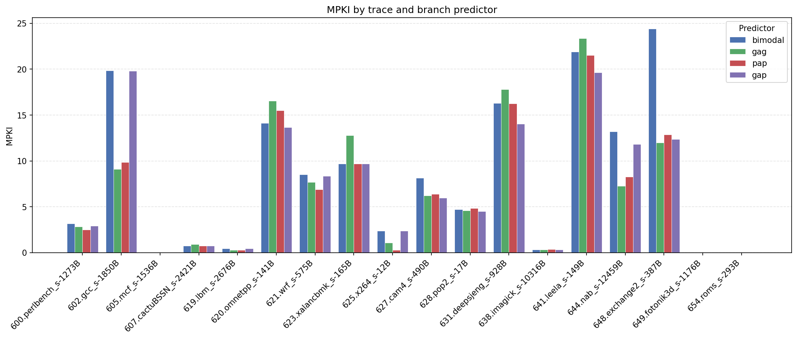

# Task 2 — Branch predictor comparison (ChampSim)

## Task objective

Evaluate and compare several branch predictors in **ChampSim** on a fixed set of CPU2017-style simulation traces. For each trace and predictor configuration, collect:

- **IPC** — instructions per cycle (performance)
- **MPKI** — branch mispredictions per 1,000 instructions (prediction quality; lower is better)

The goal is to see how predictor design (local vs global history, table size, indexing) affects performance across workloads with different branch behavior, and to summarize trends using per-trace plots plus geometric means over the full trace suite.

**Setup:** ChampSim is built from `../ChampSim` with traces in `../traces`. Experiments use **5,000,000** warmup and **25,000,000** simulation instructions per trace (see `scripts/run_all_branch.py`). Results in this document come from `output/` produced by:

```bash
./run.sh output
```

---

## Implemented predictors

All predictors are ChampSim modules under `ChampSim/branch/` and are selected via `branch_predictor` in `champsim_config.json`.

| Name | Type | Description |
|------|------|-------------|
| **bimodal** | Baseline | Per-branch 2-bit saturating counters indexed by PC (16K-entry table). No branch history. |
| **gag** | Global | **GAg** — single global shift register (14-bit history) indexes one shared 2-bit PHT (16K entries). Captures correlated branch patterns across the program. |
| **pap** | Local (per-address) | **PAp** — each of 1,021 branch slots keeps its own 4-bit local history and private 16-entry 2-bit PHT. Adapts to static per-branch bias. |
| **gap** | Global + banked | **GAp** — shared 4-bit global history; each branch slot (1,021 banks) has its own 16-entry PHT indexed by that global history. Mixes global correlation with per-branch tables. |

---

## Results

Raw measurements: [`output/branch_predictor_results.csv`](output/branch_predictor_results.csv) (18 traces × 4 predictors).

### Geometric mean (all traces)

| predictor | n_traces | n_mpki_traces | IPC_gmean | MPKI_gmean |
| --- | --- | --- | --- | --- |
| bimodal | 18 | 18 | 0.8943 | 1.9427 |
| gag | 18 | 18 | 0.9285 | 1.7260 |
| pap | 18 | 18 | 0.9356 | 1.5208 |
| gap | 18 | 18 | 0.9255 | 1.8212 |

### IPC by trace and predictor



### MPKI by trace and branch predictor



---

## Results analysis

### Geometric mean summary

Over all 18 traces, **pap** achieves the best aggregate behavior: highest **IPC_gmean** (0.9356) and lowest **MPKI_gmean** (1.5208). **gag** is second on both metrics (IPC 0.9285, MPKI 1.7260). **gap** matches **gag** on IPC (0.9255) but has higher MPKI (1.8212). **bimodal** trails on both IPC (0.8943) and MPKI (1.9427), which is expected for a history-free baseline.

Relative to bimodal, pap improves IPC_gmean by about **+4.6%** and reduces MPKI_gmean by about **−21.7%**. History-based predictors clearly help on this trace set and simulation length.

**pap vs gag:** pap’s per-branch local histories (PAp) outperform gag’s long global history (GAg) on average — local patterns dominate for these short runs. **gap** uses only 4 bits of global history with banked PHTs; it does not beat gag despite similar structure, likely because the short global history is too weak for some workloads while still polluting banks on others.

### By-trace IPC

- **Predictor-sensitive traces** (large IPC spread across predictors):
  - **648.exchange2_s** — largest spread (~0.53 IPC). **bimodal** is worst (1.146); **gag** best (1.674). History is critical here.
  - **644.nab_s**, **625.x264_s** — pap/gag clearly beat bimodal; pap wins x264 (2.467 vs ~2.25).
  - **627.cam4_s** — gap leads (1.389); pap/bimodal lower (~1.30–1.37).

- **Predictor-insensitive traces** (all predictors similar):
  - **623.xalancbmk_s** — identical IPC (0.4154) and MPKI (9.713) for all four; branch outcomes may be easy or dominated by other bottlenecks in this short slice.
  - **638.imagick_s** — all ~3.346 IPC, very low MPKI (~0.32); little room for predictor differences.
  - **605.mcf_s**, **649.fotonik3d_s**, **654.roms_s** — low MPKI and similar IPC across predictors.

- **pap** wins the most individual traces on IPC (e.g. perlbench, lbm, wrf, x264). **gap** wins several others (pop2, deepsjeng, imagick, leela, roms). **gag** wins gcc, cactuBSSN, nab, exchange2.

### By-trace MPKI

- **Highest MPKI** (all predictors struggle): **641.leela_s** (~19.6–23.4), **602.gcc_s** (~9.1–19.8), **620.omnetpp_s** (~13.7–16.6). These workloads drive the gmean MPKI up regardless of predictor.

- **Largest MPKI spread** (predictor choice matters most):
  - **648.exchange2_s** — bimodal **24.4** vs gag **12.0** (pap/gap ~12.4–12.9). Bimodal’s lack of history hurts badly.
  - **602.gcc_s** — gag **9.1** vs bimodal/gap **~19.8**; pap **9.9** also strong.
  - **644.nab_s**, **631.deepsjeng_s**, **641.leela_s** — moderate spreads; gag/pap/gap usually beat bimodal.

- **pap** achieves the best MPKI on many traces (perlbench, mcf, lbm, wrf, x264) but not all: **620.omnetpp_s** is best with **gap** (13.67); **641.leela_s** best with **gap** (19.62) while pap is worst there (21.53). So pap’s local tables help on average but can mispredict more on specific branches.

- **Low MPKI** traces (**605.mcf_s**, **649.fotonik3d_s**, **654.roms_s**, **638.imagick_s**) show little differentiation; differences in IPC on other traces come mainly from fewer stall cycles on harder benchmarks rather than from these near-zero MPKI cases.

### Overall conclusion

History-based predictors beat **bimodal** on both IPC and MPKI for this suite. **pap** (local per-branch PAp) is the best overall by geometric mean, combining strong MPKI on many integer traces with top IPC on several key benchmarks. **gag** is a solid global predictor and wins clearly where long-range correlation matters (e.g. exchange2, gcc MPKI). **gap** is competitive on some traces but inconsistent — its short global history limits benefit versus gag while banked tables add complexity. For a fixed storage budget, **local history per branch (pap)** appears the most robust choice here; **global history (gag)** is preferable when branches are strongly correlated across the program counter space (exchange2, gcc).

---

## Repository layout

```
task_2/
├── README.md
├── run.sh                          # run experiments + plots + gmean table
├── scripts/
│   ├── run_all_branch.py           # ChampSim batch runner → CSV
│   └── visualize_branch_results.py # IPC/MPKI PNGs + gmean markdown
└── output/                         # results (CSV, PNG, gmean .md)
```
