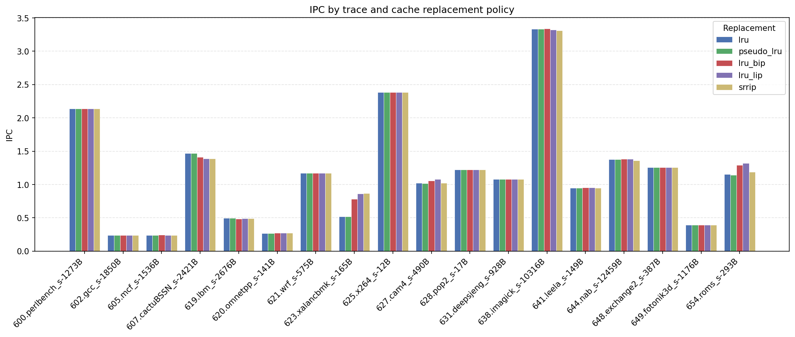
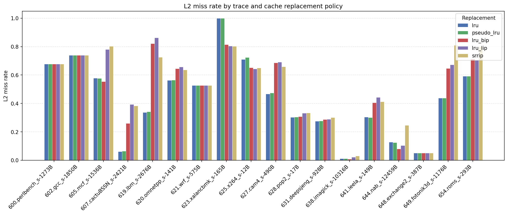

# Task 3 — Cache replacement policy comparison (ChampSim)

## Task objective

Evaluate and compare several **L2C replacement policies** in **ChampSim** on a fixed set of CPU2017-style simulation traces. For each trace and replacement configuration, collect:

- **IPC** — instructions per cycle (performance)
- **L2 miss rate** — L2 cache misses divided by total L2 accesses (lower is better)

The goal is to see how replacement design (true vs pseudo LRU, insertion policies, re-reference prediction) affects performance and cache behavior across workloads with different memory access patterns, and to summarize trends using per-trace plots plus geometric means over the full trace suite.

**Setup:** ChampSim is built from `../ChampSim` with traces in `./traces`. Experiments use **10,000,000** warmup and **50,000,000** simulation instructions per trace (`--warmup 10000000 --sim 50000000`; see `scripts/run_all_replacements.py`). Results in this document come from `output/` produced by:

```bash
./run.sh output
```

---

## Implemented replacement policies

All policies are ChampSim modules under `ChampSim/replacement/` and are selected via `L2C.replacement` in `champsim_config.json`.

| Name | Type | Description |
|------|------|-------------|
| **lru** | Baseline | True LRU using per-way last-used cycle counters; evicts the least recently used line in each set. |
| **pseudo_lru** | Approximate LRU | Tree-based pseudo-LRU (PLRU): updates binary tree bits on access instead of maintaining exact timestamps. Lower storage overhead than true LRU. |
| **lru_bip** | LRU + BIP | **Bimodal Insertion Policy (BIP):** on most fills, inserts the new line at LRU position (near-immediate eviction); every 1/32 fills uses normal LRU insertion. Reduces cache pollution from streaming/scanning traffic. |
| **lru_lip** | LRU + LIP | **Low Insertion Priority (LIP):** always inserts new lines at LRU position; hits promote lines to MRU. Protects the cache from one-time references while keeping hot lines resident. |
| **srrip** | Re-reference prediction | **Static RRIP (SRRIP):** each way holds a re-reference prediction value (RRPV); hits reset RRPV to 0, fills start at max−1; victim is the line with highest RRPV. Adapts between recency and frequency without explicit LRU stacks. |

---

## Results

Raw measurements: [`output/replacement_results.csv`](output/replacement_results.csv) (18 traces × 5 policies).

### Geometric mean (all traces)

| replacement | n_traces | n_l2_miss_rate_traces | IPC_gmean | l2_miss_rate_gmean |
| --- | --- | --- | --- | --- |
| lru | 18 | 18 | 0.8878 | 0.2965 |
| pseudo_lru | 18 | 18 | 0.8872 | 0.2975 |
| lru_bip | 18 | 18 | 0.9154 | 0.3406 |
| lru_lip | 18 | 18 | 0.9221 | 0.3868 |
| srrip | 18 | 18 | 0.9118 | 0.4142 |

### IPC by trace and replacement policy



### L2 miss rate by trace and replacement policy



---

## Results analysis

### Geometric mean summary

There is a clear **IPC vs L2 miss rate tradeoff** across policies:

- **lru_lip** achieves the best **IPC_gmean** (0.9221) but the **highest l2_miss_rate_gmean** (0.3868). Low insertion priority keeps one-shot lines from displacing reused data, which helps IPC on several workloads even when the L2 sees more misses.
- **lru_bip** is second on IPC (0.9154) with a moderate miss rate (0.3406). BIP’s mostly-LRU / occasionally-MRU insertion balances streaming resistance with reuse.
- **srrip** is third on IPC (0.9118) but has the worst aggregate miss rate (0.4142).
- **lru** and **pseudo_lru** are nearly tied on both metrics (IPC ~0.887, miss rate ~0.297) and deliver the **lowest L2 miss rates** overall.

Relative to **lru**, **lru_lip** improves IPC_gmean by about **+3.9%** while increasing l2_miss_rate_gmean by about **+30.5%**. Insertion policies (BIP/LIP) and SRRIP prioritize performance over minimizing L2 misses on this trace set and simulation length.

**lru vs pseudo_lru:** Results are almost identical in aggregate (IPC and miss rate within ~0.1%). PLRU approximates true LRU closely here; any difference shows up only on individual traces.

### By-trace IPC

- **Policy-sensitive traces** (largest IPC spread):
  - **623.xalancbmk_s** — largest spread (~0.35 IPC). **srrip** best (0.871); **lru** / **pseudo_lru** worst (~0.517). SRRIP’s re-reference prediction helps this memory-heavy trace.
  - **654.roms_s** — **lru_lip** leads (1.323) vs **pseudo_lru** (1.145); ~18% gap.
  - **607.cactuBSSN_s** — **lru** wins (1.470) vs **lru_lip** (1.392); normal LRU insertion helps this workload.

- **Policy-insensitive traces** (all policies within ~0.01 IPC):
  - **600.perlbench_s**, **621.wrf_s**, **648.exchange2_s** — identical IPC across all five policies; replacement choice does not matter on these traces.
  - **602.gcc_s**, **605.mcf_s**, **620.omnetpp_s**, **625.x264_s**, **628.pop2_s**, **631.deepsjeng_s**, **641.leela_s**, **649.fotonik3d_s** — very small spreads; differences are noise at this simulation length.

- **lru_lip** wins the most individual traces on IPC (10/18). **lru** and **lru_bip** each win 3; **srrip** wins 2 (**623.xalancbmk_s**, **649.fotonik3d_s**). **pseudo_lru** never tops IPC on any trace but stays close to **lru**.

### By-trace L2 miss rate

- **Highest miss rates** (all policies struggle): **623.xalancbmk_s** (~0.80–1.00), **619.lbm_s** (~0.34–0.86), **605.mcf_s** (~0.55–0.80). These memory-bound traces drive the gmean miss rate up.

- **Largest miss-rate spread** (policy choice matters most):
  - **619.lbm_s** — **lru** **0.338** vs **lru_lip** **0.862** (spread ~0.52). LIP’s protected insertion increases misses sharply on this streaming-style access pattern while **lru** still achieves the best IPC there.
  - **649.fotonik3d_s** — **pseudo_lru** **0.438** vs **srrip** **0.809**.
  - **607.cactuBSSN_s** — **lru** **0.062** vs **lru_lip** **0.394**; true LRU insertion keeps the working set compact.

- **Low miss-rate traces** (**638.imagick_s** ~0.008–0.030, **648.exchange2_s** ~0.050, **644.nab_s** ~0.08–0.25) show little IPC differentiation; the cache is not the bottleneck.

- **lru** achieves the lowest L2 miss rate on the most traces (7/18). **pseudo_lru** wins 4, **lru_bip** and **lru_lip** each 3, **srrip** only 1 (**623.xalancbmk_s**). Lowest miss rate and highest IPC rarely align on the same policy.

### Overall conclusion

**Baseline LRU and pseudo-LRU** minimize L2 misses but sit at the bottom of the IPC ranking. They are appropriate when miss rate is the primary metric and storage for true LRU timestamps is acceptable (pseudo_lru offers a similar outcome with lower metadata cost).

**Insertion policies** change the performance profile: **lru_lip** is the best IPC choice on average and wins most individual traces, at the cost of substantially higher L2 miss rates on streaming workloads (**619.lbm_s**, **607.cactuBSSN_s**). **lru_bip** is a practical middle ground — better IPC than LRU with a smaller miss-rate penalty than LIP or SRRIP.

**SRRIP** is competitive on IPC and clearly wins on **623.xalancbmk_s**, but its high aggregate miss rate makes it less attractive as a default. For this trace suite and 50M-instruction runs, **lru_lip** is the strongest performance-oriented L2C policy, while **lru** / **pseudo_lru** remain the conservative choice when minimizing L2 misses matters more than peak IPC.

---

## Repository layout

```
task_3/
├── README.md
├── run.sh                              # run experiments + plots + gmean table
├── scripts/
│   ├── run_all_replacements.py         # ChampSim batch runner → CSV
│   └── visualize_replacement_results.py # IPC / L2 miss rate PNGs + gmean markdown
└── output/                             # results (CSV, PNG, gmean .md)
```
